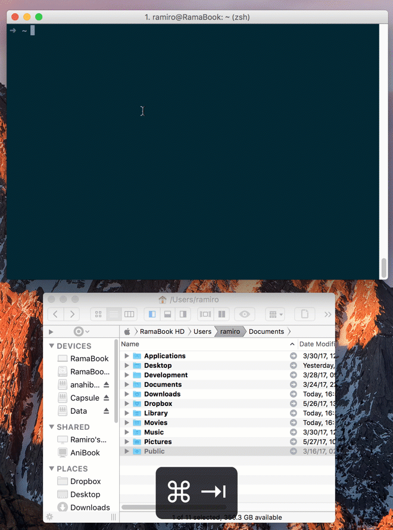

# Alfred Center Pointer on Active Window Workflow

Simple workflow to center the mouse/trackpad pointer into the current window. Specially handy for multi-monitor setups.

**Note:** You'll need accessibility permissions for Alfred in order for the workflow to work correctly.

## Usage

Just type `^ + ⌥ + ⌘ + C` (or your defined shortcut) and the mouse cursor will be immediately centered in the currently active app.

## Installation
Download the [center-pointer-on-active-window.alfredworkflow](center-pointer-on-active-window.alfredworkflow?raw=true) and import to Alfred 3 and set a shortcut, for example `^ + ⌥ + ⌘ + C`.
